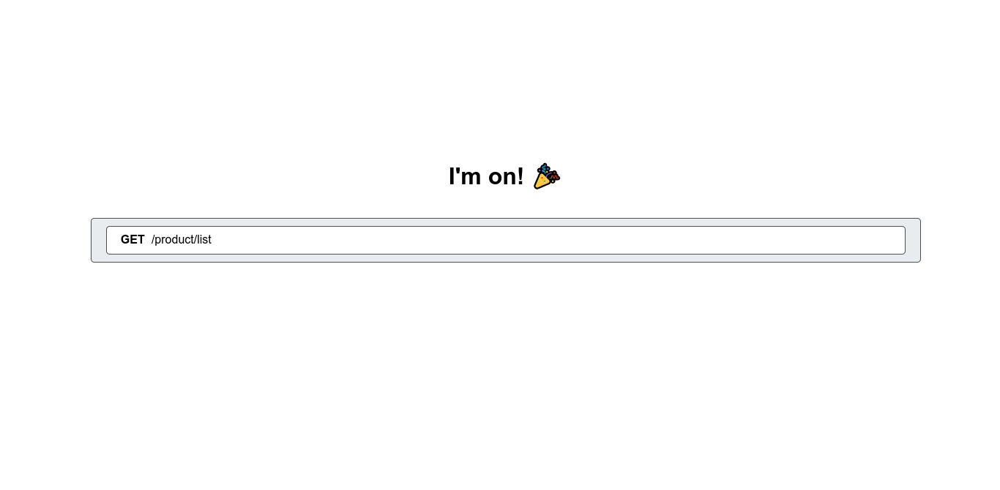

# Food ordering app

## Server

### Folder structure

```bash
.
├── controllers                             # Controllers/ Routes for each entity
├── db                                      # Database configurations
├── env.sample                              # Sample environment variables
├── express                                 # Express configurations
├── index.ts                                # Root file
├── models                                  # Models
├── types                                   # Typing for entities and other stuff
├── utils
│   ├── AppConfig.ts                        # App global variables and configurations
│   ├── modelUtils.ts                       # Model helper functions
│   ├── modelValidation.ts                  # Model validation functions
│   └── routeConfig.ts                      # Route decorator
└── views                                   # Api view
    └── index.html
```

### Setup

You will need the following programs installed

- Postgresql (_should download version 13.6_)
- Nodejs (_should download lts version_)
- Typescript

After installed all the above programs, following these step

- Step 1: Create a database call `food_ordering_app` in postgresql(_recommend using datagrip to make thing easier_)

```sql
CREATE DATABASE foold_ordering_app
```

- Step 2: Install dependencies

```bash
cd food-ordering-app
cd server
npm install # Or yarn
```

- Step 3: Complete .env file
  - Change file env.sample to .env
  - Fill in required information
  - Example
  ```
  DB_NAME=food_ordering_app
  DB_HOST=localhost
  DB_USERNAME=user that own the database
  PORT=5002
  ```
- Step 4: Run the api
  - Mac OS/ Linux
  ```bash
  npm run server # Or yarn server
  ```
  - Windows
    - Run
    ```bash
    tsc -w
    ```
    - Copy folder views in `server` to `server/dist`
    - Then run
    ```bash
    npm run start # Or yarn start
    ```

To get the list of every route available, go to [localhost:5002](http://localhost:5002/),
you will see a screen with ui like this:



Or go to [localhost:5002/api](http://localhost:5002/api) if you prefer `json` format
